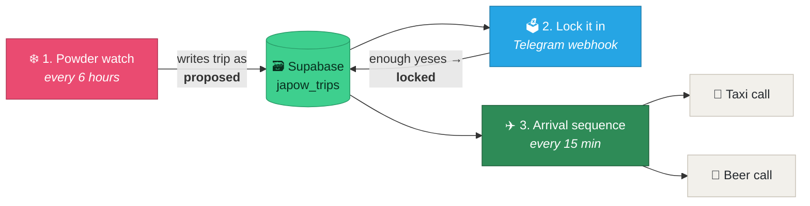

<h1 align="center">🏂 JAPOW EVENT</h1>

<p align="center">
  <b>When Niseko gets buried, this books the trip before you've even checked the forecast.</b>
</p>

<p align="center">
  
  
  
  
  
</p>

---

It watches the snow forecast every 6 hours. When it sees **40cm overnight, three
days under -10°C, and clear skies on the fourth**, it prices flights and chalets,
ranks the chalets by how far you'd walk to the lift **in ski boots**, drops the
whole proposal into your group chat with a poll, and — once the boys vote yes —
tracks the flight and has a taxi and a slab of Sapporo waiting when you land.

Three workflows, not one, because a trip spans weeks and no n8n execution stays
open that long.



---

## The three workflows

| | File | Trigger | What it does |
|---|---|---|---|
| ❄️ | `workflows/1-powder-watch.json` | Every 6 hours | Scrapes the forecast, decides if it's ON, prices flights + chalets, posts the proposal and poll, writes the trip to Supabase as `proposed` |
| 🗳️ | `workflows/2-lock-it-in.json` | Telegram webhook | Catches the poll answers. Enough yeses and the trip flips to `locked` |
| ✈️ | `workflows/3-arrival-sequence.json` | Every 15 min + webhook | Tracks the flight. 30 min before landing it books the transfer; 10 min from the chalet it orders the beers |

Workflow 1 does not talk to workflow 3 directly. The trip row in Supabase is the
handoff, which is what lets days pass in between.

---

## What's real and what isn't

Worth being straight about this, because most "automation" demos quietly aren't.

**Genuinely real:**
- Snow forecast — scraped from snow-forecast.com. There is no API; the page is
  server-rendered and every row carries a `data-row=` attribute, so it parses cleanly.
- Flights and chalets — Apify actors, field shapes verified against live runs.
- Telegram messages and the poll — Bot API.
- Flight tracking — AeroDataBox. `arrival.revisedTime` is the live ETA.
- Phone location — OwnTracks in HTTP mode, or an iOS Shortcut posting to a webhook.
- Driving ETA — the public OSRM router, free and keyless.

**Cannot be a pure API call, and here's why:**
- **Booking the flight** — no consumer booking API exists. A human pays.
- **Booking the taxi** — no consumer taxi API in Japan.
- **Ordering the beers** — there is no public consumer Uber Eats API. Uber's Eats
  APIs are merchant/POS side only, behind an NDA and partner approval.

For the last two the system places a **real phone call** with [Bland.ai](https://bland.ai)
to a number you set. That is still genuine automation. It's just voice, because
voice is the only interface those businesses expose.

---

## Setup

**1. Import the workflows**

In n8n: **Workflows → Import from File**, one at a time.

**2. Create the credentials**

Every credential was stripped from these files. Add your own under
**Credentials → New** and attach them to the nodes that need them:

| | Credential | Used by |
|---|---|---|
| 🗳️ | Telegram API | the message and poll nodes |
| 🗃️ | Supabase API | the trip state rows |
| 🌐 | Header Auth (Apify) | the flight and chalet lookups |
| 📞 | Header Auth (Bland) | the two phone calls |

**3. Replace the placeholders**

Search each workflow for `YOUR_` and fill in:

```
YOUR_TELEGRAM_BOT_TOKEN    from @BotFather
YOUR_TELEGRAM_CHAT_ID      your group chat id (add @RawDataBot to the group once)
YOUR_SUPABASE_PROJECT      your project ref, the bit before .supabase.co
YOUR_RAPIDAPI_KEY          rapidapi.com, subscribe to AeroDataBox
YOUR_PHONE_NUMBER          where the Bland calls should go
```

⚠️ **Put the bot token in an n8n credential, not in a node URL.** These files
have it as a placeholder in the URL because that's how the original was built,
and that was a mistake — anyone with access to the n8n project can read node
parameters. Move it to a Header Auth credential before you rely on it.

**4. Make the Supabase table**

```sql
create table japow_trips (
  id           bigserial primary key,
  status       text not null default 'proposed',
  depart_date  date,
  return_date  date,
  resort       text,
  flight_no    text,
  chalet       jsonb,
  conditions   jsonb,
  created_at   timestamptz default now()
);
```

**5. Tune the trigger**

The thresholds live in the `Evaluate JAPOW` code node:

```js
const SNOW_CM  = 40;   // overnight dump that counts
const COLD_C   = -10;  // must stay at or below this...
const COLD_RUN = 3;    // ...for this many days straight
```

Loosen them if you want it firing more often. `40cm / -10°C / 3 days` is a
genuinely rare event, which is the point.

---

## Costs

Free apart from the paid lookups, and those only run when a trip actually
triggers — a handful of times a season:

- **Apify** — flights + chalets, roughly a few cents a run. Set a spend cap.
- **AeroDataBox** — free tier covers this easily.
- **Bland.ai** — about US$0.09/min, so a few cents per call.
- **n8n** — free self-hosted, or the cloud starter tier.

Set a hard spend cap on Apify before you run anything. Actor runs bill per
compute unit and an unbounded crawl gets expensive faster than you'd think.

---

## Built by

[Mycelium AI](https://myceliumai.com.au) — automation for businesses that would
rather be doing something else.

The full build is on YouTube. If you get this running, I'd love to see it.

MIT licensed. Do what you like with it.
